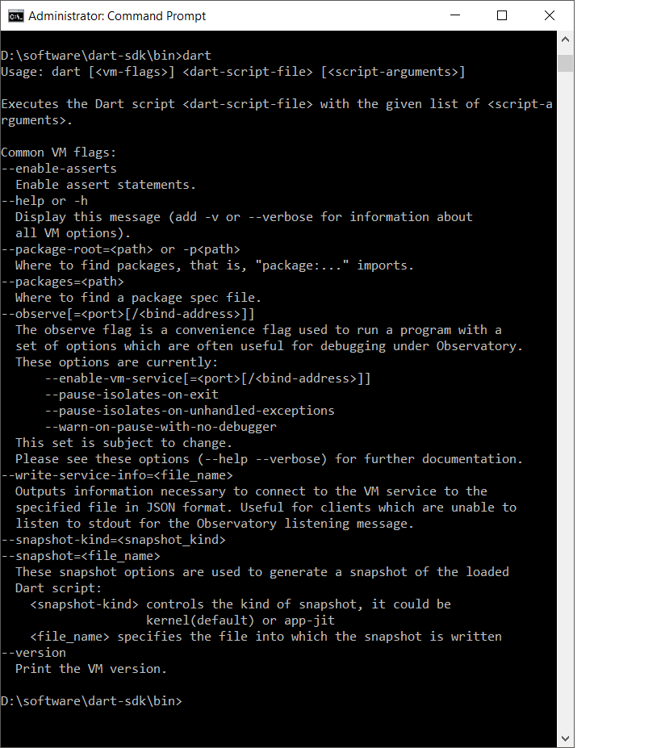

# Dart
* Contains DART programming language 
# Software Required
   1. Dart-SDK - INSTALLATION
      
   * Goto https://dart.dev/tools/sdk/archive for windows.
     
         step 1: Download the zip file from above url.
     
         
         step 2: Un zip the download file i.e. extract that file.
    
         
         step 3: Past the un-zipped folder you get in any of the drive 
                 strongly recommended to past in the drive windows installed.
  
  
         step 4: Open command prompt and set the directory to the bin folder of dart-sdk.        
      

