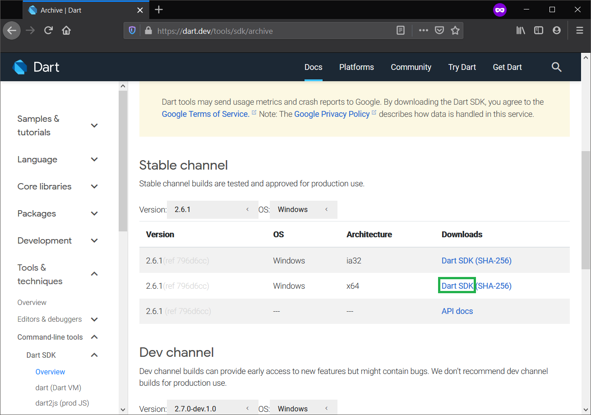
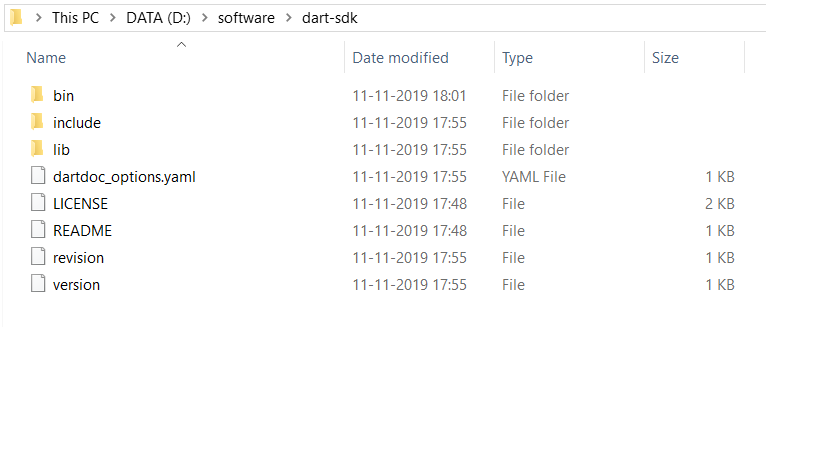
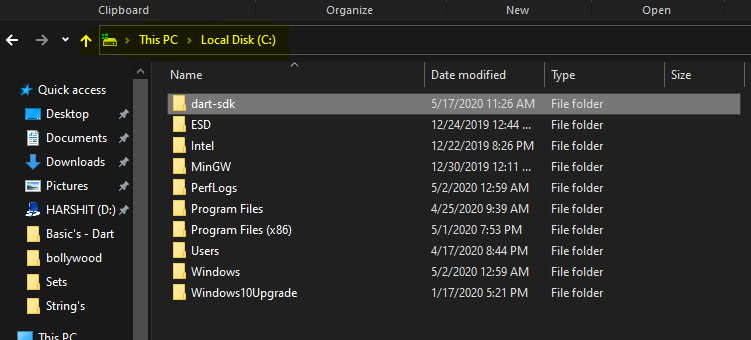
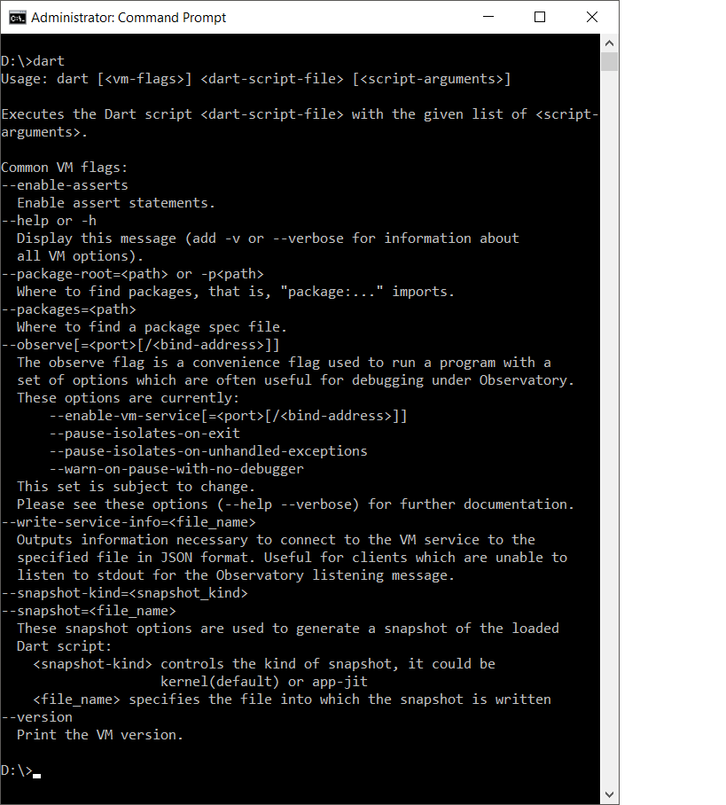
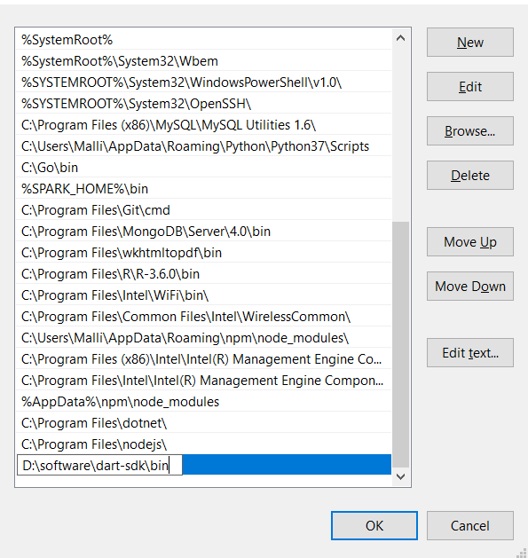

# Dart
* Contains DART programming language
* Used in flutter 

# Topic's Included
  * Basics of Dart.
  * Data types.
  * String.
  * Type Conversions
  * Constant
  * Null
  * Operators.
  * Loop
  * Collections [List,Set,Map].
  * Functions.
  * Class.
  * Exception Handling.
  
# Software Required
   1. Dart-SDK - INSTALLATION
      
   * Goto https://dart.dev/tools/sdk/archive for windows.
   * Goto https://dart.dev/get-dart for Linux and Mac.
     
         step 1: Download the zip file from above url.
     
         
         step 2: Un zip the download file i.e. extract that file.
    
         
         step 3: Past the un-zipped folder you get in any of the drive 
                 strongly recommended to past in the drive windows installed.
  
  
         step 4: Open command prompt and set the directory to the bin folder of dart-sdk and run it for once.        
  
        
         step 5: Add Dart Path to PATH Environment Variable
  
           
         step 6: Restrt the command prompt.
     
   
   2.  Atom Text Editor - Installation OR any text editor you have but strongly recommended to use "Atom" or "visual studio". 
         
        * Download Atom from https://atom.io this link.                          
               
        * Download Visual Studio from https://code.visualstudio.com.                  

      

